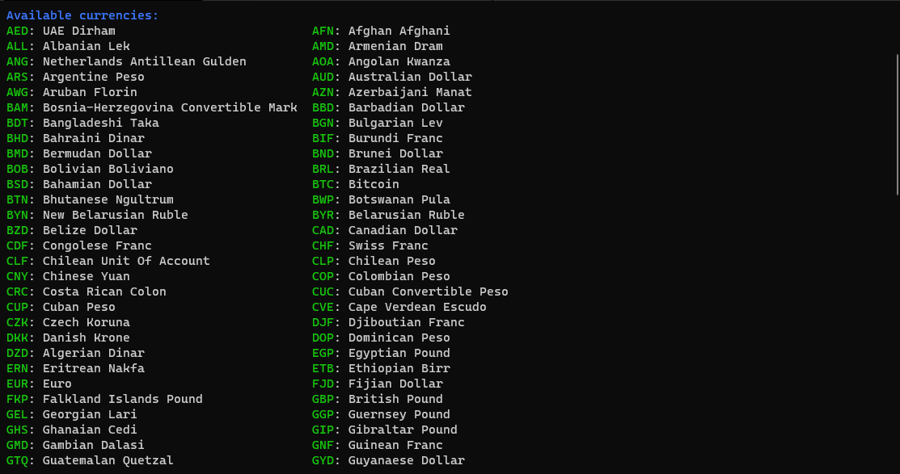
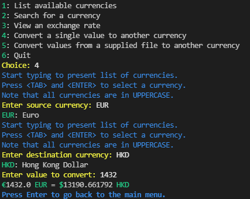
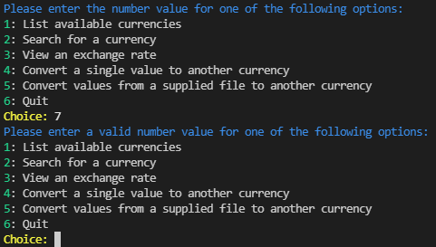
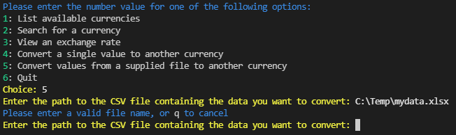
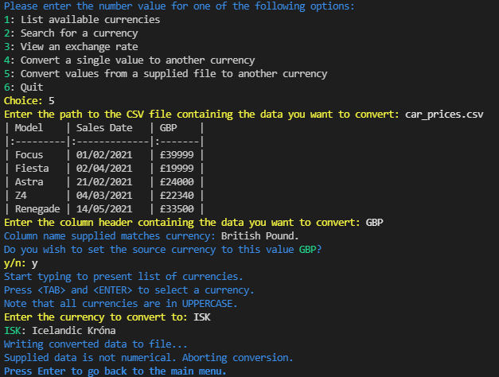

# Currency Converter

This project is a Python command line application that can convert numerical values between different currencies.  

The application can be used in a web browser at [Heroku Deployment](https://currency-converter-sijil82.herokuapp.com/)
**Note:** Due to limitations within the terminal template used to deploy the application as a web page, some parts of the application do not function as intended:
- The autocomplete functionality does not load. This is purely cosmetic, and the user can type out the currency name manually.
- Because the terminal does not have access to the underlying VM and file structure, the option to load a file cannot function.
- For full functionality, it is recommended to clone the project and run the application locally by following the steps in the Deployment section.  

## Table of Contents
* [Design](#design)
    * [User Stories](#user-stories)
    * [Application Workflow](#application-workflow)
* [Features](#features)
    * [User Menu](#user-menu)
    * [Up to Date Data](#up-to-date-data)
    * [View All Currencies](#view-all-currencies)
    * [View a Currency Conversion Rate](#view-a-currency-conversion-rate)
    * [Convert a Single Value](#convert-a-single-value)
    * [Convert Values in File](#convert-values-in-file)
* [Testing](#testing)
    * [User Story Testing](#user-story-testing)
    * [Application Testing](#application-testing)
* [Deployment](#deployment)
* [Credits](#credits)

# Design
## User Stories
-  __As a user of the application, I want to:__
    - Enter 2 currencies and see the exchange rate between them.  
        - Seeing the rate in both directions would be a bonus.  
    - Enter a source currency, a destination currency and a value, and have the value converted into the destination currency.  
        - See the exchange rate that was used for the calculation.  
    - Be sure any calculations I make are using the latest exchange data.  
    - Have an intuitive UI that makes it clear what operations I can perform.  
    - Be able to make calculations quickly, without having to type out the entire currency name.  
        - Being shown currency abbreviations would be a bonus, so I don't have to look them up.  
    - Have the ability to pass in a spreadsheet of data to be processed, rather than have to enter each calculation manually.  
## Application Workflow
Below is a high level overview of the workflow through the application.  

# Features
- ## User Menu
    - Options presented to user allowing them to control the program flow.  
    - Created dynamically from an array of objects defining the actions, making it easy to expand.  
    - The "Quit" option is automatically appended to the end of the list.  
    - Colour formatting makes the menu clear to users.  
    - Validation ensures only numerical values from the list can be chosen.  
    
- ## Up to Date Data
    - When the program is run, the latest list of currencies are pulled from the API automatically without the user needing to request them.  
    - All currency conversion data is pulled from the API as it is requested, ensuring data is as up to date as possible.  
- ## View All Currencies
    - Choosing option 1 on the menu will list all the available currencies.  
    - The 3 letter currency ID and full currency name are both displayed, with colour formatting to improve readability.   
    - The currency list is displayed in a dynamic column layout, where the number of columns automatically fits the size of the terminal the application is run in  
        - Default xTerm console (80 characters wide):  
        
        - Default Windows 10 Terminal (120 characters wide):  
        
        - Windows 10 Terminal fullscreen (423 characters wide):  
        
- ## View a Currency Conversion Rate
    - Prompts user for a source then destination currency to show an exchange rate for.  
    - User can start typing any 3 letter currency ID and the application will show an autocomplete prompt for currencies that match what they are typing.  
        - Note that currencies are stored in uppercase, and the user must also enter the currency they want to use in uppercase for it to match.  
    
    - After choosing both currencies, the application displays the currency conversion in both directions in a clear readable format.  
    
- ## Convert a Single Value  
    - Prompts user for a source then destination currency, followed by a numerical amount to convert.  
    - User can again use the auto complete functionality to choose the currencies they wish to use.    
    - Displays the value entered converted to the destination currency in a user readable format.  
      
    - Converted value retains all decimal places from the calculation, so it can be used for an application where precise calculations are critical.  
- ## Convert Values in File  
    - Prompts the user for:  
        - A .CSV file to read.  
        - A column in that file with data in to convert.  
        - Source currency to convert from. If the column header matches a currency, asks the user if they wish to use that, rather than prompt for the currency.  
        - Destination currency to convert to.  
    
    - The data in the supplied column is converted to the destination currency, and the new data is appended to the file as a new column.  
        - A sample `car_prices.csv` file is included with this project that can be used to test the process.
            -  
        - Source data:  
        
        - After column has been converted and new data saved to file:  
        
# Testing
## User Story Testing
-  __User Features Requested:__
    - Request: Enter 2 currencies and see the exchange rate between them.  
        - Result: The user can choose the "View and exchange rate" option, enter their 2 currencies and be shown the exchange rate between these currencies.  
        - Request: Seeing the rate in both directions would be a bonus.  
            - Result: The application automatically returns the exchange rate for the chosen currencies in both directions.  
    - Request: Enter a source currency, a destination currency and a value, and have the value converted into the destination currency.  
        - Result: The user can choose the "Convert a single value to another currency" option, enter their currencies and a value to be converted and will be shown the converted amount.  
        - Request: See the exchange rate that was used for the calculation.  
            - Result: This was not implemented as it made the user experience feel cluttered. However the user can choose the "View an exchange rate" option to see the rate used for 2 currencies.
    - Request: Be sure any calculations I make are using the latest exchange data.  
        - Result: The application pulls the latest available data from the API each time a calculation is performed.
    - Request: Have an intuitive UI that makes it clear what operations I can perform.  
        - Result: The application has a clear menu and user prompts, with consistent colour formatting added to assist with presenting information to the user.  
    - Request: Be able to make calculations quickly, without having to type out the entire currency name.  
        - Result: The application uses only the 3 letter abbreviation for a currency for inputs by the user, making it quicker to enter chosen currencies.  
        - Request: Being shown currency abbreviations would be a bonus, so I don't have to look them up.  
            - Result: The user can choose the "List available currencies" option to present all available currencies with their full name and 3 letter abbreviation.  
    - Request: Have the ability to pass in a spreadsheet of data to be processed, rather than have to enter each calculation manually.  
        - Result: The user can choose the "Convert values from a supplied file to another currency" to load a CSV file with data they want to be converted.  
## Application Testing
- The menu input option checks for valid user input and prompts the user to input a valid choice if one is not entered:  
    - Invalid number chosen:  
    
    - Invalid alphabetical value entered:  
    
- Entering an input that doesn't match an available currency code prompts the user to enter a valid one:  

- Entering a non-numerical value to convert prompts the user to enter a valid value:  

- Entering a filename that doesn't exist when trying to convert a file's data prompts the user to enter a valid file:  

- Entering a filename with an extension that isn't .csv prompts the user to enter a valid file:  

- Providing a file to convert with data that isn't numerical will abort the conversion:  
  

# Deployment
- __To deploy the project as an application that can be run locally:__
    - **Note:** This project requires you to have [Python](https://www.python.org/) installed on your local PC.
    - Go to the [GitHub Repo](https://github.com/SiJiL82/currency-converter) page.
    - Click the `Code` button and download the ZIP file containing the project.
    - Extract the ZIP file to a location on your PC.
    - Generate an API Key at [Currency Converter API](https://free.currencyconverterapi.com/)
    - In the folder you extracted the project files to, create an `env.py` file, and add the lines:
    ```python
    import os
    os.environ.setdefault("APIKEY", "API KEY GENERATED ABOVE")
    ```
    - Open a terminal window to the location you extracted the files to, and run:  
    `python currencyconverter.py`
# Credits
- __The following resources were referenced during the development of this project:__
    - Adding colour formatting: [OzzMaker.com](https://ozzmaker.com/add-colour-to-text-in-python/)
    - Auto complete prompting: [Python Prompt Toolkit](https://python-prompt-toolkit.readthedocs.io/en/master/pages/asking_for_input.html#asking-for-input)
    - Exchange rates API: [CurrencyConverterAPI.com](https://free.currencyconverterapi.com/)