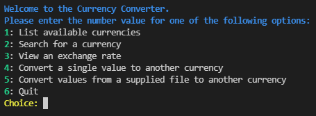
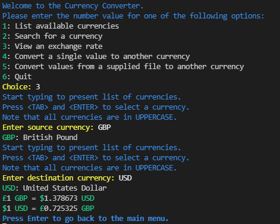

# Currency Converter

This project is a Python command line application that can convert numerical values between different currencies.  

The application can be used in a web browser at [Heroku Deployment](https://currency-converter-sijil82.herokuapp.com/)
**Note:** Due to limitations within the terminal template used to deploy the application as a web page, some parts of the application do not function as intended.  
These are only 

## Table of Contents
* [Design](#design)
    * [User Stories](#user-stories)
    * [Application Workflow](#application-workflow)
* [Features](#features)
* [Testing](#testing)
* [Deployment](#deployment)
* [Credits](#credits)

# Design
## User Stories
-  __As a user of the application, I want to:__
    - Enter 2 currencies and see the exchange rate between them.  
        - Seeing the rate in both directions would be a bonus.  
    - Enter a source currency, a destination currency and a value, and have the value converted into the destination currency.  
        - See the exchange rate that was used for the calculation.  
    - Be sure any calculations I make are using the latest exchange data.  
    - Have an intuitive UI that makes it clear what operations I can perform.  
    - Be able to make calculations quickly, without having to type out the entire currency name.  
        - Being shown currency abbreviations would be a bonus, so I don't have to look them up.  
    - Have the ability to pass in a spreadsheet of data to be processed, rather than have to enter each calculation manually.   
## Application Workflow
Below is a high level overview of the workflow through the application.  

# Features
- ## User Menu
    - Options presented to user allowing them to control the program flow.
    - Created dynamically from an array of objects defining the actions, making it easy to expand.
    - The "Quit" option is automatically appended to the end of the list.
    - Colour formatting makes the menu clear to users.
    - Validation ensures only numerical values from the list can be chosen.  
    
- ## Up to Date Data
    - When the program is run, the latest list of currencies are pulled from the API automatically without the user needing to request them.
    - All currency conversion data is pulled from the API as it is requested, ensuring data is as up to date as possible.
- ## View All Currencies
    - Choosing option 1 on the menu will list all the available currencies.
    - The 3 letter currency ID and full currency name are both displayed, with colour formatting to improve readability.
    - The currency list is displayed in a dynamic column layout, where the number of columns automatically fits the size of the terminal the application is run in
        - Default xTerm console (80 characters wide):  
        
        - Default Windows 10 Terminal (120 characters wide):
        
        - Windows 10 Terminal fullscreen (423 characters wide):
        
- ## View a Currency Conversion Rate
    - Prompts user for a source then destination currency to show an exchange rate for.
    - User can start typing any 3 letter currency ID and the application will show an autocomplete prompt for currencies that match what they are typing.
        - Note that currencies are stored in uppercase, and the user must also enter the currency they want to use in uppercase for it to match.  
    
    - After choosing both currencies, the application displays the currency conversion in both directions in a clear readable format.  
    

# Testing

# Deployment

# Credits
https://ozzmaker.com/add-colour-to-text-in-python/
https://python-prompt-toolkit.readthedocs.io/en/master/pages/asking_for_input.html#asking-for-input
https://free.currencyconverterapi.com/